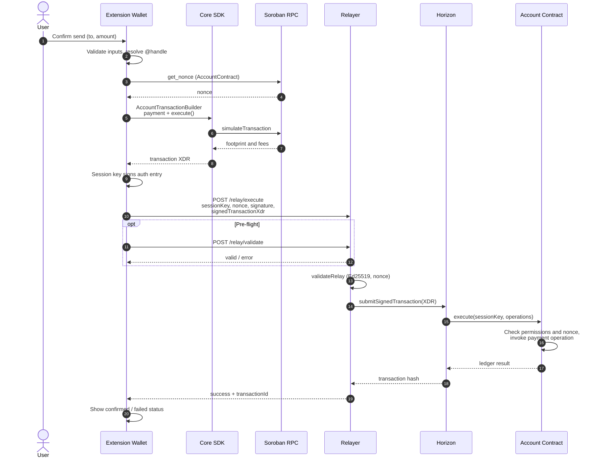

# Ancore Architecture Overview

This document provides a high-level overview of the Ancore system architecture.

## System Components

```
┌─────────────────────────────────────────────────────────────┐
│                      User Applications                       │
│  ┌──────────────┐  ┌──────────────┐  ┌──────────────┐      │
│  │  Extension   │  │    Mobile    │  │     Web      │      │
│  │    Wallet    │  │    Wallet    │  │  Dashboard   │      │
│  └──────────────┘  └──────────────┘  └──────────────┘      │
└────────────────────────┬────────────────────────────────────┘
                         │
                         │ Ancore SDK
                         │
┌────────────────────────▼────────────────────────────────────┐
│                     Core SDK Layer                           │
│  ┌──────────────┐  ┌──────────────┐  ┌──────────────┐      │
│  │   Account    │  │   Session    │  │     TX       │      │
│  │     Mgmt     │  │     Keys     │  │   Builder    │      │
│  └──────────────┘  └──────────────┘  └──────────────┘      │
└────────────────────────┬────────────────────────────────────┘
                         │
                         │
┌────────────────────────▼────────────────────────────────────┐
│                  Stellar/Soroban Layer                       │
│  ┌──────────────┐                                            │
│  │   Account    │                                            │
│  │   Contract   │                                            │
│  └──────────────┘                                            │
└────────────────────────┬────────────────────────────────────┘
                         │
                         │
                    Stellar Network
```

## Repository Module Map

The main architecture modules are organized as a monorepo. This tree intentionally lists only the top-level product, package, contract, service, and documentation modules that contributors are expected to navigate directly.

<!-- repo-structure-check:start -->

```
ancore/
├── apps/                     # User-facing applications
│   ├── extension-wallet/     # Browser extension wallet
│   ├── mobile-wallet/        # React Native mobile app
│   └── web-dashboard/        # Web-based account management
│
├── packages/                 # Public SDKs and libraries
│   ├── core-sdk/             # Main SDK for developers
│   ├── account-abstraction/  # Account abstraction primitives
│   ├── stellar/              # Stellar/Soroban utilities
│   ├── crypto/               # Cryptographic utilities
│   ├── ui-kit/               # Shared UI components
│   ├── types/                # Shared TypeScript types
│   ├── wallet-shared/      # dApp protocol, networks, allowlist keys
│   ├── wallet-api/         # npm SDK for dApps (@ancore/wallet-api)
│   └── test-fixtures/        # Shared test fixtures for apps and services
│
├── contracts/                # Soroban smart contracts
│   ├── account/              # Core account contract
│   ├── validation-modules/   # Planned pluggable validation module scaffolds
│   ├── invoice/              # Planned invoice contract scaffolds
│   └── upgrade/              # Planned upgrade contract scaffolds
│
├── services/                 # Optional infrastructure
│   ├── relayer/              # Transaction relay service
│   ├── indexer/              # Blockchain indexer
│   └── ai-agent/             # AI agent MVP (draft-only intents)
│
└── docs/                     # Documentation
    ├── architecture/         # System architecture
    ├── security/             # Security model & audits
    └── user-guide/           # End-user guides
```

<!-- repo-structure-check:end -->

Run `pnpm docs:check-structure` before merging README or architecture changes that add, rename, or remove entries in this tree. Keep this block and the README repository tree in sync; if the check should cover a different set of docs, update `scripts/check-docs-repo-structure.mjs` and the CI workflow in the same change.

## Financial OS Positioning

Ancore is designed as a financial operating system on top of Stellar:

- **Stellar (on-chain)**: settlement, assets, programmable transfer authorization
- **Ancore apps/services (off-chain)**: UX, identity, analytics, compliance workflows, notifications, support tooling

Decision rule:

- If blockchain adds trust/settlement/interoperability value -> use Stellar.
- If traditional software is faster/safer for user experience or operations -> keep it off-chain.

## Core Concepts

### Smart Accounts

Smart accounts are the foundation of Ancore. Unlike traditional accounts that use a single private key for all operations, smart accounts are programmable contracts that can implement custom validation logic.

**Key Features:**

- Custom signature validation
- Multi-signature support
- Session keys for seamless UX
- Upgradeability
- Recovery mechanisms

### Account Abstraction

Ancore brings ERC-4337-style account abstraction to Stellar/Soroban:

1. **Validation**: Custom logic determines if a transaction is valid
2. **Execution**: Transactions are executed on behalf of the account
3. **Paymaster**: Optional third-party fee payment
4. **Bundling**: Multiple operations in a single transaction

### Session Keys

Session keys enable seamless UX by allowing time-limited, permission-scoped signing keys:

- User signs once to create a session
- Session key signs subsequent transactions
- Automatic expiration
- Granular permissions
- Revocable at any time

## Data Flow

### Send Flow {#send-flow}

End-to-end path for an extension wallet payment authorized by a **session key** and submitted through the **relayer**. This matches the production integration shape: build and sign in the client, validate and broadcast via `@ancore/relayer`, enforce rules on the **account contract**, settle on **Horizon**.

| Step | Component | Responsibility |
|------|-----------|----------------|
| 1 | Extension wallet | UX, validation, handle resolution, fee estimate |
| 2 | Core SDK | Build `Operation.payment`, wrap in `execute`, simulate via Soroban RPC, assemble XDR |
| 3 | Extension (background) | Session key signs Soroban auth entry; never exposes owner key |
| 4 | Relayer | `POST /relay/validate` (optional), `POST /relay/execute` — signature + nonce checks |
| 5 | Horizon | Accepts signed envelope from relayer (`StellarClient.submitTransaction`) |
| 6 | Account contract | `execute` verifies session key permissions and nonce, runs inner ops |
| 7 | Extension | Polls relayer/indexer or Horizon for confirmation |



**Code references**

- Extension send UI: `apps/extension-wallet/src/hooks/useSendTransaction.ts`, `apps/extension-wallet/src/screens/Send/`
- SDK builders: `packages/core-sdk/src/account-transaction-builder.ts`, `packages/core-sdk/src/execute-with-session-key.ts`, `packages/core-sdk/src/send-payment.ts`
- Relayer API: `services/relayer/README.md` (`POST /relay/execute`, `POST /relay/validate`)
- On-chain entrypoint: `contracts/account` — `execute(address, Vec<bytes>)`
- Network submission: `services/relayer/src/services/stellarSubmitter.ts` → `@ancore/stellar` → Horizon

**Alternate path (no relayer):** When the owner key signs directly, `sendPayment()` in `@ancore/core-sdk` can submit through `StellarClient.submitTransaction` without calling the relayer. Session-key sends in the extension are expected to use the relay path above so the owner key stays offline.

### Transaction Flow (summary)

For other operation types (session-key management, contract calls), the same pattern applies: SDK builds the Soroban invocation → client signs → relayer validates and submits → account contract enforces policy → Horizon settles.

### Account Creation

```
1. Generate key pair
   ↓
2. Deploy account contract
   ↓
3. Initialize with owner
   ↓
4. Set up validation modules
   ↓
5. (Optional) Configure recovery
```

## Security Architecture

### Trust Boundaries

1. **User's Private Key**: Ultimate source of authority
2. **Account Contract**: Enforces validation rules
3. **Validation Modules**: Pluggable validation logic
4. **Session Keys**: Limited, scoped permissions
5. **Relayers**: Untrusted transaction submitters

### Security Layers

- **Contract Level**: Validation, access control, nonce management
- **SDK Level**: Transaction building, signing, encryption
- **Application Level**: UI security, phishing protection

## Scalability

### Gas Optimization

- Minimal on-chain storage
- Efficient validation algorithms
- Batch operations
- Off-chain computation where possible

### Relayer Network

Optional relayer network for:

- Meta-transactions
- Gasless transactions
- Transaction batching
- Network fee abstraction

## Integration Points

### For Developers

1. **Core SDK**: JavaScript/TypeScript SDK for building applications
2. **Contract ABIs**: Direct contract interaction
3. **REST API**: Optional backend services
4. **WebSocket**: Real-time updates

### For Users

1. **Browser Extension**: Web3 wallet extension
2. **Mobile Apps**: iOS/Android wallets
3. **Web Dashboard**: Account management interface

## Future Architecture

### Planned Enhancements

- [ ] Cross-chain support via bridges
- [ ] Privacy features (zk-proofs)
- [ ] Advanced recovery mechanisms
- [ ] Decentralized relayer network
- [ ] AI-powered financial agent

## Related Documents

- [Integration guide](../integration-guide.md) (companion table links to [Send flow](#send-flow))
- [Account Contract](../../contracts/account/README.md)
- [Session Keys](./SESSION_KEYS.md)
- [Security Model](../security/THREAT_MODEL.md)
- [API Reference](../api/REFERENCE.md)

---

> Note: Planned contract and service scaffolds are intentionally present in the repository layout so contributors can preserve the architecture direction without implying production completeness.

**Last Updated**: May 2026
